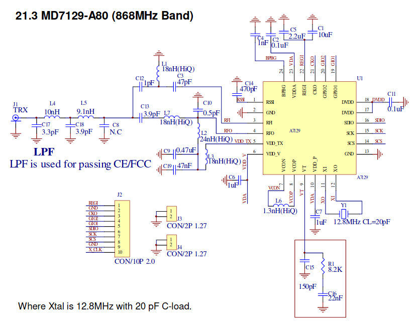
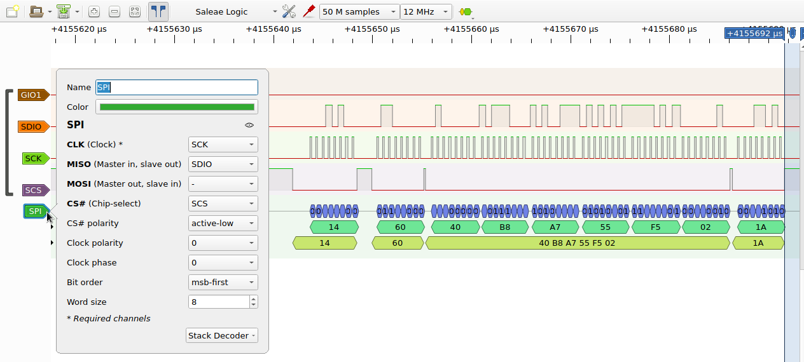

# Amiccom A7129 Library

This is library to support Amiccom A7129 FSK/GFSK Sub 1GHz Transceiver IC
on Arduino, Mongoose OS and Espressif ESP-IDF

Amiccom A7129 is interresting IC which allows simple digital communication
to occur across variety of sub 1GHz bands, while keeping power consumption reasonably low
and allowing microcontroller to enter sleep state while waiting for incomming transmission.

## Project status

While API is still subject to change and/or it might eventualy introduce new features,
we have succesfully deployed this library in commercialy available consumer products.
These were based on ESP32 and Mongoose OS. Other platforms were not so heavily tested,
so the code might need some minor tweaks...

Library is not fully making use of every feature described in the A7129 datasheet,
however the basic communication of sending short data packets back and forth works just fine.

## Connection & Circuit

This library needs following pins to be connected to microcontroller:
  * SDIO
  * SCK
  * SCS
  * GIO1

To improve reliability it's possible to add 1K protection resistors on data lines between uC and RF chip.

This is reference schematic as provided by A7129 datasheet:

## Debugging

In case of need you can use sigrok/pulseview https://sigrok.org/ with following settings to capture the SPI communication on data pins of the RF chip:

## Notes

At least some of the amiccom chips seem to have buggy hardware implementation of CRC, so in critical applications please use software checksums to ensure message integrity at application level. Learned this very hard way.

## TODO

  * Write doxygen documentation for everything
  * Code cleanup?
  * Support for AliOS Things (on esp32), already prepared in `amiccom_rf_hal.h`
  * Better API for interrupt registration
  * Support tuning to any arbitrary frequency, not just the predefined set of channels
  * Support for other bands than 433 and 868MHz
  * Support for other xtals than 12.8MHz
  * Support for "direct communication mode" (no FIFO)
  * Use stdint.h types wherever possible
  * Hack library to transmit OOK modulated signal using (G)FSK ICs
    (in continuous carrier mode it might be possible to do OOK using rapidly sending CMD_TX and CMD_STANDBY)
  * Hack library to receive OOK modulated signal using (G)FSK ICs (carrier detect output on GPIO1 pin???)
  * Figure out whether this code is compatible with other Amiccom chips, namely:
    * A7102, A7103, A7108, A7112, A7128, A7129, A7139, A7159
    * A7201, A7202
    * A7302, A7328, A7329, A7339
    * A9108, A9109, A9112, A9129, A9139, A9159, A9508

## See also

  * http://read.pudn.com/downloads699/sourcecode/embedded/2814944/A7129%20Datasheet%20v1.0.pdf
  * http://read.pudn.com/downloads699/sourcecode/embedded/2814944/A7139_Datasheet_v1.1.pdf (datasheet of similar chip)
  * http://amiccom.weebly.com/uploads/3/9/5/9/3959395/a7129_datasheet_v0.5_preliminary.pdf
  * http://en.pudn.com/Download/item/id/2814944.html
